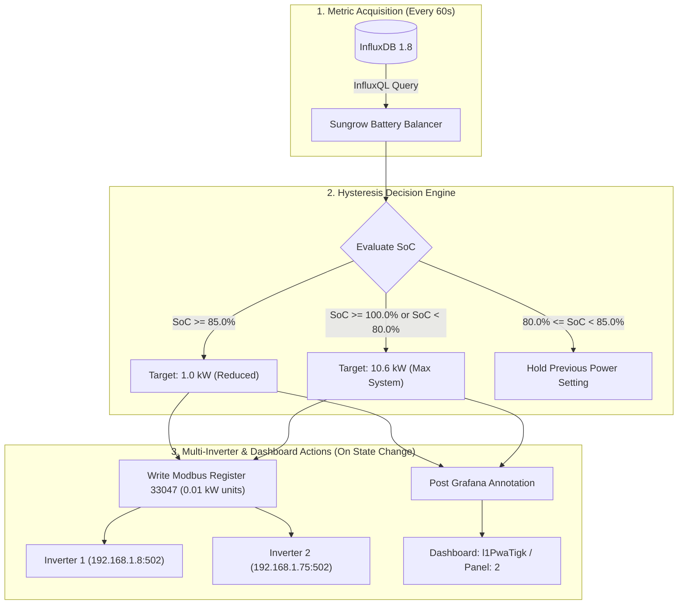

# Sungrow Battery Balancer

[](https://opensource.org/licenses/Apache-2.0)
[](https://www.python.org/)
[]()

A robust, containerized Python service that dynamically regulates the maximum charging power of a **Sungrow SBR256** high-voltage battery connected to dual **Sungrow SH10RT-20** hybrid inverters.

The application reads real-time battery State-of-Charge (SoC) from an **InfluxDB 1.8.x** time-series instance, applies hysteresis control to balance cell charging speed, dispatches write-only commands over **Modbus TCP** to all connected inverters, and annotates **Grafana dashboards** whenever power adjustments occur.

---

## Architecture & Control Logic



### State-of-Charge (SoC) Hysteresis Rules

| Battery SoC (%) | Action / Power Limit | Rationale |
| :--- | :--- | :--- |
| **SoC $\ge$ 85.0%** | **1.0 kW** (`REDUCED_CHARGING_POWER`) | Throttles charging power as cells reach high SoC to prevent cell voltage divergence and balance the pack. |
| **SoC $\ge$ 100.0%** | **10.6 kW** (`MAX_CHARGING_POWER`) | Pack is completely full; charging stops automatically via BMS. Max capability restored for next cycle. |
| **SoC < 80.0%** | **10.6 kW** (`MAX_CHARGING_POWER`) | Battery has discharged below recovery threshold; full charging speed is enabled to maximize solar harvesting. |
| **80.0% $\le$ SoC < 85.0%** | **Maintain Current State** | Hysteresis deadband prevents high-frequency relay/register cycling between 80% and 85%. |

---

## Sungrow Modbus Protocol Specification

The service strictly adheres to the official *Sungrow Communication Protocol of Residential and Small Industrial Hybrid Inverter* (Section 3.2.2, Table 6):

- **Target Register**: `33047` (`Max. Charging Power`, Data Type: `U16`, Unit/Ratio: `0.01 kW`, Read-Write).
- **Register Addressing Offset**: Per Sungrow specification (Section 4, Rule 1), all registers are addressed 0-indexed by subtracting 1.
  $$\text{Effective Modbus Wire Address} = 33047 - 1 = 33046\text{ (0x8116)}$$
- **Value Encoding**:
  - $1.0\text{ kW} \rightarrow 100\text{ (0x0064)}$
  - $10.6\text{ kW} \rightarrow 1060\text{ (0x0424)}$
- **Write-Only Policy**: The application strictly issues Modbus `write_register` commands and **never reads** from inverters over Modbus, eliminating any risk of poll contention or bus timeouts.

---

## Configuration Reference

Parameters can be provided via **CLI switches** or **Environment Variables**. CLI switches always take precedence.

| CLI Argument | Environment Variable | Required | Default | Description |
| :--- | :--- | :---: | :--- | :--- |
| `--influxdb-url` | `INFLUXDB_URL` | **Yes** | — | InfluxDB 1.8 endpoint (e.g. `https://influxdb.example.com:8086`) |
| `--influxdb-user` | `INFLUXDB_USER` | **Yes** | — | InfluxDB username (`pv-monitoring-read`) |
| `--influxdb-password` | `INFLUXDB_PASSWORD` | **Yes** | — | InfluxDB password |
| `--influxdb-db` | `INFLUXDB_DB` | **Yes** | — | InfluxDB database (`pv_monitoring`) |
| `--influxdb-query` | `INFLUXDB_QUERY` | No | `SELECT MAX(...)` | InfluxQL query retrieving current battery level |
| `--no-verify-ssl` | `INFLUXDB_VERIFY_SSL` | No | `true` | Set to false to disable SSL verification for InfluxDB |
| `--inverter-hosts` | `INVERTER_HOSTS` | **Yes** | — | Comma-separated inverter endpoints (`192.168.1.8:502,192.168.1.75:502`) |
| `--modbus-slave-id` | `MODBUS_SLAVE_ID` | No | `1` | Inverter Modbus Unit/Slave ID |
| `--modbus-register` | `MODBUS_REGISTER` | No | `33047` | Sungrow Max Charging Power register |
| `--modbus-register-offset` | `MODBUS_REGISTER_OFFSET`| No | `-1` | Register offset (default `-1` yields 33046) |
| `--modbus-timeout` | `MODBUS_TIMEOUT` | No | `5.0` | Modbus TCP socket timeout in seconds |
| `--grafana-url` | `GRAFANA_URL` | **Yes** | — | Base URL of Grafana instance |
| `--grafana-token` | `GRAFANA_TOKEN` | **Yes** | — | Grafana Service Account / API token |
| `--grafana-dashboard-uid` | `GRAFANA_DASHBOARD_UID` | **Yes** | — | Grafana dashboard UID (`l1PwaTigk`) |
| `--grafana-panel-id` | `GRAFANA_PANEL_ID` | **Yes** | — | Target panel ID for annotations (`2`) |
| `--high-soc-threshold` | `HIGH_SOC_THRESHOLD` | No | `85.0` | SoC (%) to reduce charging power |
| `--low-soc-threshold` | `LOW_SOC_THRESHOLD` | No | `80.0` | SoC (%) to restore max charging power |
| `--full-soc-threshold` | `FULL_SOC_THRESHOLD` | No | `100.0`| SoC (%) considered full charge |
| `--reduced-charging-power`| `REDUCED_CHARGING_POWER`| **Yes** | `1.0` | Throttled charging power in kW |
| `--max-charging-power` | `MAX_CHARGING_POWER` | **Yes** | `10.6` | Maximum charging power in kW |
| `-i`, `--check-interval` | `CHECK_INTERVAL` | No | `60` | Loop interval in seconds |
| `--log-level` | `LOG_LEVEL` | No | `INFO` | Logging level (`DEBUG`, `INFO`, `WARNING`, `ERROR`) |
| `-1`, `--one-shot` | `ONE_SHOT` | No | `false` | Run single cycle with report and exit |
| `-n`, `--dry-run` | `DRY_RUN` | No | `false` | Simulate execution without sending writes/annotations |
| `--set-power` | — | No | `None` | Explicit power override (kW) in one-shot mode |

---

## Installation & Deployment

### Option 1: Docker / Docker Compose (Recommended)

1. Create your environment configuration:
   ```bash
   cp .env.example .env
   # Edit .env and fill in your passwords and tokens
   ```

2. Start the container using Docker Compose:
   ```bash
   docker compose up -d
   ```

3. View live logs:
   ```bash
   docker compose logs -f
   ```

### Option 2: Local Python Runtime

1. Ensure Python 3.10+ is installed (`pyenv` recommended).
2. Create and activate a virtual environment:
   ```bash
   python3 -m venv .venv
   source .venv/bin/activate
   ```
3. Install dependencies:
   ```bash
   pip install -e .
   ```
4. Run the continuous monitoring loop:
   ```bash
   export INFLUXDB_URL="https://influxdb.example.com:8086"
   export INFLUXDB_USER="pv-monitoring-read"
   export INFLUXDB_PASSWORD="your_password"
   export INFLUXDB_DB="pv_monitoring"
   export INVERTER_HOSTS="192.168.1.8:502,192.168.1.75:502"
   export GRAFANA_URL="https://grafana.example.com"
   export GRAFANA_TOKEN="your_grafana_token"
   export GRAFANA_DASHBOARD_UID="l1PwaTigk"
   export GRAFANA_PANEL_ID="2"
   export REDUCED_CHARGING_POWER="1.0"
   export MAX_CHARGING_POWER="10.6"

   sungrow-battery-balancer
   ```

---

## Execution Modes & Diagnostics

### Continuous Loop Mode (Default)
Runs in a non-blocking loop every 60 seconds (configurable). Catches transient InfluxDB network drops, Modbus connection timeouts, or Grafana API failures without terminating the daemon.

### One-Shot Debugging Mode (`--one-shot` / `-1`)
Performs a single evaluation cycle, displays a masked configuration diagnostic table, and prints a structured execution report:

```bash
sungrow-battery-balancer --one-shot
```

#### Output Example:
```text
----------------------------------------------------------------------
 Sungrow Battery Balancer Configuration
----------------------------------------------------------------------
 Execution Mode           : ONE-SHOT
 Dry Run (Simulation)     : DISABLED (Active)
 Check Interval           : 60s
 Log Level                : INFO

 InfluxDB 1.8 Configuration:
   URL                    : https://influxdb.example.com:8086
   User                   : pv-monitoring-read
   Password               : se****rd
   Database               : pv_monitoring
   Verify SSL             : True
   Query                  : SELECT MAX(last_battery_level) FROM (...)

 Sungrow Inverter Modbus TCP:
   Target Inverters       : 192.168.1.8:502, 192.168.1.75:502
   Slave ID               : 1
   Modbus Register (Doc)  : 33047 (Offset: -1 -> 0-indexed: 33046)
   Modbus Timeout         : 5.0s

 Grafana Annotations:
   URL                    : https://grafana.example.com
   Token                  : gl****en
   Dashboard UID          : l1PwaTigk
   Panel ID               : 2

 Charging Power & Thresholds:
   High SoC Threshold     : >= 85.0% -> Throttled Power: 1.0 kW
   Low SoC Threshold      : < 80.0% -> Restored Power: 10.6 kW
   Full SoC Threshold     : >= 100.0% -> Restored Power: 10.6 kW
   Hysteresis Deadband    : [80.0%, 85.0%) maintains current state
----------------------------------------------------------------------

[One-Shot Mode] Querying InfluxDB and executing battery balancer cycle...

======================================================================
 ONE-SHOT EXECUTION REPORT
======================================================================
 Current Battery SoC      : 86.4%
 Target Charging Power    : 1.00 kW
 Decision Reason          : Battery SoC is high (86.4% >= 85.0%). Throttling max charging power to 1.0 kW.
 Modbus Register Written  : YES
 Inverter Results         :
   - 192.168.1.8:502          : SUCCESS
   - 192.168.1.75:502         : SUCCESS
 Grafana Annotation Set   : YES
 Grafana Annotation ID    : 142
======================================================================
```

### Dry-Run Simulation Mode (`--dry-run` / `-n`)
Reads real SoC values from InfluxDB and logs exact Modbus register calculations without sending bytes to the inverters or modifying Grafana:

```bash
sungrow-battery-balancer --one-shot --dry-run
```

### Manual Target Power Override (`--set-power KW`)
Manually sets the max charging power to an explicit kW value on all inverters and posts a Grafana annotation (bypassing SoC calculation):

```bash
sungrow-battery-balancer --one-shot --set-power 5.0
```

---

## Development & Testing

Install development dependencies:
```bash
pip install -r requirements-dev.txt
```

Run test suite with coverage report:
```bash
pytest --cov=sungrow_battery_balancer --cov-report=term-missing tests/
```

Format and lint codebase:
```bash
ruff check .
ruff format .
```

---

## License

This project is licensed under the **Apache License 2.0**. See the [LICENSE](LICENSE) file for details.
